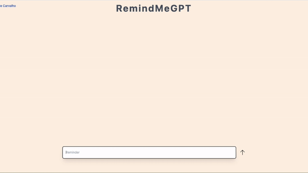

# 🧠 RemindMeGPT
<p align="center">
    
</p>

This is a simple reminder app proof-of-concept developed with **GPT-4**. Here users can create reminders, change their statusus and ask ChatGPT about them. For example, the user could ask chat GPT to:

- `Please summarise all my reminders in a simple and comprehensive way whilst giving me advice on how to complete them`
- `What reminders do I have today?`
- `Can you tell me something about Luís de Camões`

## 🏃 Running RemindMeGPT
An environment file needs to be created in the project root called `.env.local` that includes the following env variables:
```
NEXT_PUBLIC_OPENAI_API_KEY=<API_KEY_GOES_HERE>
NEXT_PUBLIC_ORG_ID=<ORG_ID_GOES_HERE>
```
To run this project run the following commands:
```bash
npm install
npm run dev
```
A local version of the web-app can be accessed in `localhost:3000`

## 🤔 How it works

### Technologies
This PoC uses the following stack:
- Next JS Typescript
- Tailwind CSS
- React Redux
- OpenAI GPT-4

### Usage
- All text written in the text area at the bottom is set as a reminder if they are not prefixed with a `/ask`.
- Reminders can be switched between completed and uncompleted by clicking them. 
- Any question can be asked to GPT, be it about the reminders (as these are also sent though) or anything else. 

### Implementation

#### System prompt
There is a system prompt that is always sent along with the chat dictionary in every request. This is set within the `openAIHooks` and currently holds the current prompt:
```
You are a personal reminder assistant. You are fed with several reminders that include information about the reminder.
You must then answer any question that your boss asks you about the reminders he 
gives you to analyse in plain English. Make it short, remember he doesn't have
much time! Get back to work!
```

#### Reminder bundling
All the chats are bundled up appropriately in a format that Chat GPT-4 understands. This whole formatting process occurs within the custom `openAIHooks` file. Here every reminder is bundled up into the form:

    Reminder: <REMINDER CONTENTS> recorded on: <REMINDER TIMESTAMP> and is complete? <COMPLETE STATUS>, ...

These bundled reminders are then slotted into a dictionary with different prompt formatting, the following cases are considered:

1. If there is no agent response within the chat history then they are just sent as:
```javascript
{role:'user', content: 'Reminder: <REMINDER CONTENTS> recorded on: <REMINDER TIMESTAMP> and is complete? <COMPLETE STATUS>, ...'}
```
2. If after a set of reminders there is an agent response, that is then followed by more reminders, then first set of reminders are bundled up in the same way described in the previous point. But the next set of reminders are prefixed with `More reminders` before being added to the dictionary. 

3. If the user asks a question and the last entry into the reminder history is a reminder, then every reminder from a previous agent response (if any) up to the last reminder is bundled up in the same format described in point (1) but prefixed with `Given the previous chat history and these additional reminders: ` which is postfixed with the user's question.

#### Question formatting
A question is sent to the GPT API every time a `/ask` command is detected within the text area. Every word that proceeds this is then added to the dictionary that is sent to the API in the following format:
```javascript
{role:'user', content: '<QUESTION>'}
```
However, the content will get prefixed with reminders if there exists reminders prior to the question in history (as detailed above). 

#### Key takeaways 
1. The reminders are bundled up until an agent response message is encountered. Every agent response is also put into a dictionary entry in the following format:
```javascript
{role: 'assistant', content: '<AGENT RESPONSE>'}
```
 > This was done to allow the system to preserve contextual history. 

2. The blue boxes that are displayed to the user showing the asked question is not sent along within the API request. 

3. These reminders are then put into the `message` section of the dictionary sent to the OpenAI GPT-4 Chat API. 

4. The text area automatically resizes depending on user input

5. The user's questions are included into the reminder history in blue. 

6. ChatGPT-4 responses are formatted in orange.  

## 🚫 Limitations
- This is only a PoC and is not intended for production use. In production a backend should be made holding all the interactions that happen between the user and the Open AI API.

- GPT-4's `8,192` token context limitation, this is approximately 60 words, which can limit how many reminders are sent through with the user's question. 

  - A workaround would be to use [LlamaIndex's](https://gpt-index.readthedocs.io/en/latest/index.html) [Vector Store Index](https://gpt-index.readthedocs.io/en/latest/guides/index_guide.html#vector-store-index) to determine the most relevant reminders to send through using Cosine-Similarity. 

## 👉💻 Example usage
For a higher quality walkthrough use this [video](https://www.youtube.com/watch?v=lIp0EV68jAg).


